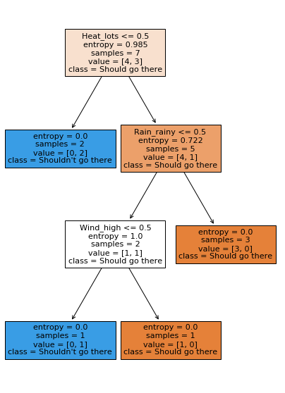

```python
%matplotlib inline
from matplotlib import pyplot as plt
plt.rcParams['figure.figsize'] = (7,10)

import numpy as np
import pandas as pd
from sklearn import tree
from sklearn.preprocessing import LabelEncoder
import collections
from sklearn.model_selection import GridSearchCV, cross_val_score
from sklearn.tree import DecisionTreeClassifier, plot_tree
from sklearn.ensemble import RandomForestClassifier
from sklearn.metrics import accuracy_score
import graphviz
 
```


```python
#Creating the dataset
def create_df(dic, feature_list):
    out = pd.DataFrame(dic)
    out = pd.concat([out, pd.get_dummies(out[feature_list])], axis = 1)
    out.drop(feature_list, axis = 1, inplace = True)
    return out

# Some feature values are present in train and absent in test and vice-versa.
def intersect_features(train, test):
    common_feat = list( set(train.keys()) & set(test.keys()))
    return train[common_feat], test[common_feat]
features = ['Rain', 'Snow','Wind','Heat']

#Training Data
df_train = {}
df_train['Rain'] = ['rainy', 'rainy', 'rainy', 'dry',
                         'dry', 'dry', 'rainy'] 
df_train['Snow'] = ['yes', 'yes', 'no', 'no', 'yes', 'yes', 'yes']
df_train['Wind'] = ['high', 'low', 'average', 'average', 'low',
                                   'high', 'average']
df_train['Heat'] = ['lots', 'little', 'lots', 'little', 'lots',
                                  'lots', 'lots']
df_train['Should_Vacation_there'] = LabelEncoder().fit_transform(['+', '-', '+', '-', '-', '+', '+'])

df_train = create_df(df_train, features)
df_train
```


<div>
<style scoped>
    .dataframe tbody tr th:only-of-type {
        vertical-align: middle;
    }

    .dataframe tbody tr th {
        vertical-align: top;
    }

    .dataframe thead th {
        text-align: right;
    }
</style>
<table border="1" class="dataframe">
  <thead>
    <tr style="text-align: right;">
      <th></th>
      <th>Should_Vacation_there</th>
      <th>Rain_dry</th>
      <th>Rain_rainy</th>
      <th>Snow_no</th>
      <th>Snow_yes</th>
      <th>Wind_average</th>
      <th>Wind_high</th>
      <th>Wind_low</th>
      <th>Heat_little</th>
      <th>Heat_lots</th>
    </tr>
  </thead>
  <tbody>
    <tr>
      <td>0</td>
      <td>0</td>
      <td>0</td>
      <td>1</td>
      <td>0</td>
      <td>1</td>
      <td>0</td>
      <td>1</td>
      <td>0</td>
      <td>0</td>
      <td>1</td>
    </tr>
    <tr>
      <td>1</td>
      <td>1</td>
      <td>0</td>
      <td>1</td>
      <td>0</td>
      <td>1</td>
      <td>0</td>
      <td>0</td>
      <td>1</td>
      <td>1</td>
      <td>0</td>
    </tr>
    <tr>
      <td>2</td>
      <td>0</td>
      <td>0</td>
      <td>1</td>
      <td>1</td>
      <td>0</td>
      <td>1</td>
      <td>0</td>
      <td>0</td>
      <td>0</td>
      <td>1</td>
    </tr>
    <tr>
      <td>3</td>
      <td>1</td>
      <td>1</td>
      <td>0</td>
      <td>1</td>
      <td>0</td>
      <td>1</td>
      <td>0</td>
      <td>0</td>
      <td>1</td>
      <td>0</td>
    </tr>
    <tr>
      <td>4</td>
      <td>1</td>
      <td>1</td>
      <td>0</td>
      <td>0</td>
      <td>1</td>
      <td>0</td>
      <td>0</td>
      <td>1</td>
      <td>0</td>
      <td>1</td>
    </tr>
    <tr>
      <td>5</td>
      <td>0</td>
      <td>1</td>
      <td>0</td>
      <td>0</td>
      <td>1</td>
      <td>0</td>
      <td>1</td>
      <td>0</td>
      <td>0</td>
      <td>1</td>
    </tr>
    <tr>
      <td>6</td>
      <td>0</td>
      <td>0</td>
      <td>1</td>
      <td>0</td>
      <td>1</td>
      <td>1</td>
      <td>0</td>
      <td>0</td>
      <td>0</td>
      <td>1</td>
    </tr>
  </tbody>
</table>
</div>


```python
#Test data
df_test = {}
df_test['Rain'] = ['rainy', 'rainy', 'dry'] 
df_test['Snow'] = ['no', 'yes', 'yes']
df_test['Wind'] = ['average', 'high', 'average']
df_test['Heat'] = ['lots', 'little', 'lots']
df_test = create_df(df_test, features)
df_test
```


<div>
<style scoped>
    .dataframe tbody tr th:only-of-type {
        vertical-align: middle;
    }

    .dataframe tbody tr th {
        vertical-align: top;
    }

    .dataframe thead th {
        text-align: right;
    }
</style>
<table border="1" class="dataframe">
  <thead>
    <tr style="text-align: right;">
      <th></th>
      <th>Rain_dry</th>
      <th>Rain_rainy</th>
      <th>Snow_no</th>
      <th>Snow_yes</th>
      <th>Wind_average</th>
      <th>Wind_high</th>
      <th>Heat_little</th>
      <th>Heat_lots</th>
    </tr>
  </thead>
  <tbody>
    <tr>
      <td>0</td>
      <td>0</td>
      <td>1</td>
      <td>1</td>
      <td>0</td>
      <td>1</td>
      <td>0</td>
      <td>0</td>
      <td>1</td>
    </tr>
    <tr>
      <td>1</td>
      <td>0</td>
      <td>1</td>
      <td>0</td>
      <td>1</td>
      <td>0</td>
      <td>1</td>
      <td>1</td>
      <td>0</td>
    </tr>
    <tr>
      <td>2</td>
      <td>1</td>
      <td>0</td>
      <td>0</td>
      <td>1</td>
      <td>1</td>
      <td>0</td>
      <td>0</td>
      <td>1</td>
    </tr>
  </tbody>
</table>
</div>


```python
# Some feature values are present in train and absent in test and vice-versa.
y = df_train['Should_Vacation_there']
df_train, df_test = intersect_features(train=df_train, test=df_test)
df_train

#training a decision tree
dt = DecisionTreeClassifier(criterion='entropy', random_state=17)
dt.fit(df_train, y);

#displaying the tree
plot_tree(dt, feature_names=df_train.columns, filled=True,
        class_names=["Should go there", "Shouldn't go there"]);


```





```python

```


```python

```
